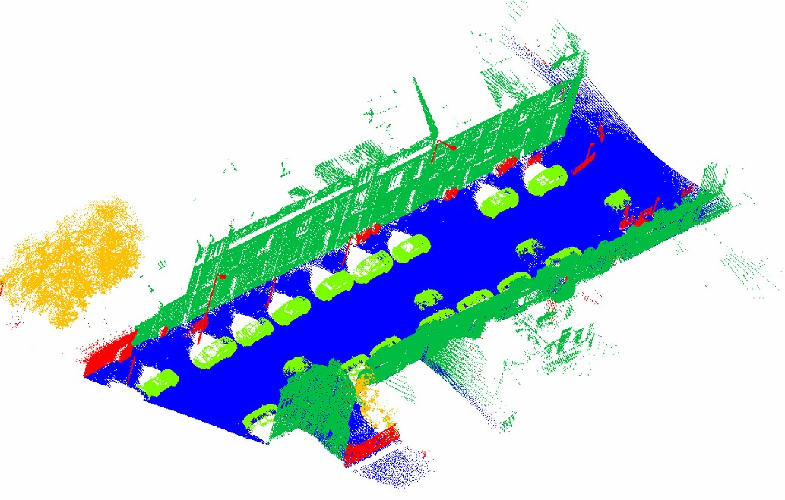
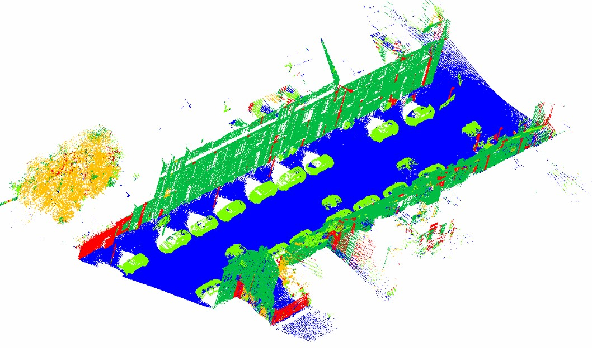
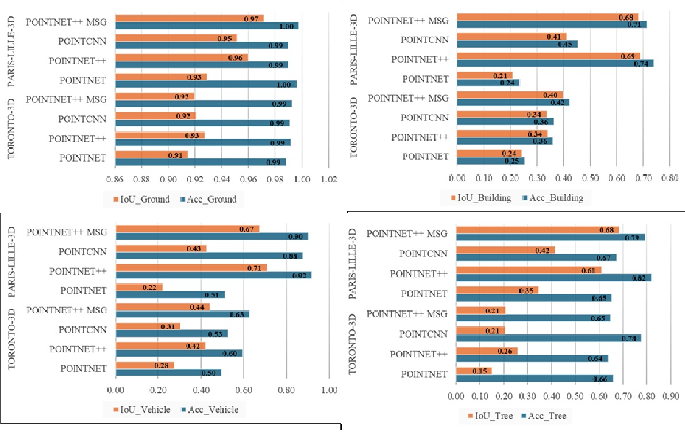

<h1 align="center">Outdoor LiDAR Semantic Segmentation</h1>

<p align="center">
  <em>A unified PyTorch benchmark of PointNet / PointNet++ (SSG &amp; MSG) / PointCNN<br/>
  for outdoor LiDAR point-cloud semantic segmentation on <b>Paris-Lille-3D</b> and <b>Toronto-3D</b>.</em>
</p>

<p align="center">
  
  
  
  
  
</p>

---

## About

This repository is an end-to-end PyTorch pipeline for **semantic segmentation of large-scale outdoor LiDAR point clouds**. It targets two public urban-scene datasets — **Paris-Lille-3D** (mobile mapping, Velodyne HDL-32E) and **Toronto-3D** (mobile mapping, Teledyne Optech Maverick) — and unifies their heterogeneous label schemes into a shared **5-class label space** (Ground / Building / Vehicle / Vegetation / Unclassified).

Four model families are implemented from scratch in pure PyTorch (no custom CUDA ops required):

- **PointNet** — vanilla PointNet with T-Net (`STN3d` + `STNkd`) input/feature alignment.
- **PointNet++ SSG** — Single-Scale-Grouping set abstraction + feature propagation.
- **PointNet++ MSG** — Multi-Scale-Grouping at multiple radii / neighbor counts.
- **PointCNN** — XConv blocks with dilated k-NN grouping.

The pipeline includes block-based sampling (grid + random-shape + multi-scale), class-balanced weighted sampling, Focal / CE+Dice "Combo" losses, mixed-precision training, W&B logging, and PLY-based visual inference output.

### Topics

`point-cloud` `semantic-segmentation` `pointnet` `pointnet-plus-plus` `pointcnn` `pytorch` `lidar` `3d-deep-learning` `paris-lille-3d` `toronto-3d` `outdoor-scene-understanding` `autonomous-driving` `mobile-mapping`

### Repository

[`bhagatdas/multidataset-multimodel-pointcloud-semseg`](https://github.com/bhagatdas/multidataset-multimodel-pointcloud-semseg)

**About:** PyTorch benchmark of PointNet, PointNet++ (SSG/MSG), and PointCNN for outdoor LiDAR semantic segmentation on Paris-Lille-3D and Toronto-3D.

---

## Table of Contents

1. [Project Layout](#project-layout)
2. [Pipeline Overview](#pipeline-overview)
3. [Datasets & Label Unification](#datasets--label-unification)
4. [Setup](#setup)
5. [Running the Pipeline](#running-the-pipeline)
6. [Configuration](#configuration)
7. [Data Preprocessing](#data-preprocessing)
8. [Dataset & DataLoader](#dataset--dataloader)
9. [Models](#models)
10. [Losses & Class Weighting](#losses--class-weighting)
11. [Training](#training)
12. [Testing / Inference](#testing--inference)
13. [Metrics & Visualization](#metrics--visualization)
14. [Results](#results)
15. [Contributors](#contributors)
16. [Citation](#citation)
17. [License](#license)

---

## Project Layout

```
Point cloud- segmantic segmentation/
├── config.py                  # Central dataclass-based configuration
├── dataset.py                 # PreprocessedDataset + get_dataloaders()
├── preprocess_datasets.py     # Raw PLY → unified 5-class segments
├── train.py                   # Training loop with W&B logging
├── test.py                    # Visual inference + metrics on a chosen split
├── requirements.txt           # Conda / pip setup instructions
├── step.md                    # Quick run cheatsheet
├── models/
│   ├── pointnet.py            # Vanilla PointNet (with T-Net STN3d / STNkd)
│   ├── pointnet2.py           # PointNet++ SSG (SA + FP layers)
│   ├── pointnet2_msg.py       # PointNet++ MSG (multi-scale grouping)
│   ├── pointcnn.py            # PointCNN (XConv + dilated kNN)
│   ├── losses.py              # FocalLoss, ComboLoss (CE + Dice)
│   └── utils.py               # FPS, kNN-ball, index_points, sample_and_group
├── utils/
│   ├── data_utils.py          # PointCloudProcessor / DataAugmentation / BlockSplitter
│   ├── class_weights.py       # 5 class-weight strategies
│   ├── metrics.py             # IoU / accuracy / confusion matrix
│   ├── inference_utils.py     # InferenceManager → PLY + summary.json
│   └── visualization_utils.py # 3D scatter / confusion matrix / per-class IoU
├── data/                      # Raw and preprocessed data (gitignored)
└── results/                   # Saved figures / plots from runs
```

---

## Pipeline Overview

```
                ┌────────────────────────┐
 Raw PLYs ──►  │ preprocess_datasets.py │ ──► data/preprocessed/<dataset>/{train,val,test}/*.ply
                └────────────────────────┘                  (unified 5-class labels)
                                │
                                ▼
                ┌────────────────────────┐
                │  dataset.py             │  block-wise sampling (grid / random / multi-scale)
                │  PreprocessedDataset    │  + augmentation + FPS sampling to num_points
                └────────────────────────┘
                                │
                                ▼
                ┌────────────────────────┐
                │  train.py               │  PointNet / PointNet++ / PointNet++ MSG / PointCNN
                │   build_model(config)   │  + CE / Focal / Combo loss + class weights + cosine LR
                └────────────────────────┘
                                │
                                ▼
                ┌────────────────────────┐
                │  test.py                │  inference + metrics + colored PLY for visualization
                └────────────────────────┘
```

---

## Datasets & Label Unification

The two source datasets have very different label schemes, so they are mapped onto a **unified 5-class** target space defined in [config.py](config.py#L31-L37):

| ID | Class         |
|----|---------------|
| 0  | Ground        |
| 1  | Building      |
| 2  | Vehicle       |
| 3  | Vegetation    |
| 4  | Unclassified  |

### Paris-Lille-3D (10 coarse → 5 unified)

Mapping in [preprocess_datasets.py:18-29](preprocess_datasets.py#L18-L29):

| Source label | Source class                  | Unified |
|--------------|-------------------------------|---------|
| 0            | unclassified                  | 4       |
| 1            | ground                        | 0       |
| 2            | building                      | 1       |
| 3            | pole / road sign / light      | 4       |
| 4            | bollard / small pole          | 4       |
| 5            | trash can                     | 4       |
| 6            | barrier                       | 4       |
| 7            | pedestrian                    | 4       |
| 8            | car                           | 2       |
| 9            | natural / vegetation          | 3       |

### Toronto-3D

Mapping in [preprocess_datasets.py:31-37](preprocess_datasets.py#L31-L37):

| Source label(s) | Unified |
|-----------------|---------|
| 1, 2            | 0 (Ground)       |
| 4               | 1 (Building)     |
| 7               | 2 (Vehicle)      |
| 3               | 3 (Vegetation)   |
| 0, 5, 6, 8      | 4 (Unclassified) |

---

## Setup

From [requirements.txt](requirements.txt):

```bash
# Create environment
conda create -n pointnet_env python=3.8
conda activate pointnet_env

# PyTorch + CUDA 11.8
conda install pytorch torchvision torchaudio pytorch-cuda=11.8 -c pytorch -c nvidia

# Core dependencies
pip install numpy pandas scikit-learn tqdm h5py plyfile
pip install tensorboard wandb           # logging (optional)
pip install optuna joblib               # tuning (optional)
```

## Running the Pipeline

Quick run from [step.md](step.md):

```bash
# 1. Preprocess each dataset individually
python preprocess_datasets.py --dataset Toronto-3D     --data_dir data/
python preprocess_datasets.py --dataset Paris-Lille-3D --data_dir data/

# 1b. Or both at once with a custom segmentation
python preprocess_datasets.py --dataset both --data_dir data/ \
    --num_segments 16 --train_segments 14 --val_segments 1 --test_segments 1

# 2. Edit values in config.py, then train
python train.py

# 3. Run visual inference on a split
python test.py --split test
```

---

## Configuration

All knobs live in the `Config` dataclass in [config.py](config.py).

| Section | Field | Default | Notes |
|---------|-------|---------|-------|
| Dataset  | `dataset_name`          | `"paris_lille_3d"` | or `"toronto_3d"` |
| Dataset  | `paris_lille_path`      | `./data/preprocessed/Paris-Lille-3D` | |
| Dataset  | `toronto_3d_path`       | `./data/preprocessed/Toronto-3D` | |
| Model    | `model_type`            | `"pointnet2"` | `pointnet`, `pointnet2`, `pointnet2_msg`, `pointcnn` |
| Sampling | `num_points`            | `4096` | per-block points fed to the model |
| Sampling | `block_size` / `stride` | `1.0` / `1.0` | XY window size; `stride < block_size` → overlap |
| Training | `batch_size`            | `16` | |
| Training | `num_epochs`            | `30` | |
| Training | `learning_rate`         | `1e-3` | Adam |
| Training | `weight_decay`          | `1e-4` | |
| Training | `loss_function`         | `"combo"` | `ce`, `focal`, `combo` |
| Training | `focal_gamma`           | `2.0` | for `FocalLoss` |
| Training | `combo_alpha`           | `0.5` | CE vs Dice mix in `ComboLoss` |
| Training | `feature_transform_reg` | `0.001` | PointNet T-Net regularizer |
| Aug.     | `use_augmentation`      | `True` | rotation / scale / jitter / flip |
| Aug.     | `class_balance_sampling`| `True` | enables `WeightedRandomSampler` on train |
| Aug.     | `use_fps`               | `False` | FPS instead of random sampling at `__getitem__` |
| Hardware | `mixed_precision`       | `True` | enables AMP `autocast` when on CUDA |
| I/O      | `checkpoint_dir`        | `./checkpoints` | |
| I/O      | `save_frequency`        | `5` | epochs |
| Eval     | `visualize_results`     | `True` | |

`Config` exposes derived properties such as `dataset_path`, `class_names`, `num_classes`, `effective_block_size`, and `effective_stride`.

---

## Data Preprocessing

[preprocess_datasets.py](preprocess_datasets.py) does the following:

1. **Load** raw PLY files
   - Toronto-3D: merges `L001.ply`–`L004.ply`, supports both `red/green/blue/intensity/label` and the `scalar_*` variants
   - Paris-Lille-3D: reads `Lille1.ply` and uses the 10-class `class` field
2. **Deduplicate** points at 1 cm precision via `np.unique(round(xyz * 100))`
3. **Remap labels** to the unified 5-class space
4. **Split by trajectory** — slices the point cloud into `num_segments` equal Y-axis chunks
5. **Write** each segment to `data/preprocessed/<dataset>/{train,val,test}/*.ply`
6. **Emit `metadata.json`** containing per-segment point counts and class distributions

CLI:

```bash
python preprocess_datasets.py \
  --dataset {Paris-Lille-3D|Toronto-3D|both} \
  --data_dir data/ \
  --output_dir ./data/preprocessed \
  --num_segments 8 \
  --train_segments 6 \
  --val_segments 1 \
  --test_segments 1
```

Output PLY fields:
- **Toronto-3D**: `x, y, z, red, green, blue, intensity, label`
- **Paris-Lille-3D**: `x, y, z, intensity, label`

---

## Dataset & DataLoader

[dataset.py](dataset.py) defines `PreprocessedDataset` and `get_dataloaders()`.

### Block generation strategies
For each segment PLY, the dataset can build blocks via three modes (combined on `train` if `use_multi_view_blocks=True`):

1. **`_build_equal_grid_blocks`** ([dataset.py:188-228](dataset.py#L188-L228)) — regular XY grid using `(block_size, stride)`.
2. **`_build_random_shape_blocks`** ([dataset.py:230-272](dataset.py#L230-L272)) — random overlapping XY rectangles (independent of `block_size`).
3. **`_build_multi_scale_blocks`** ([dataset.py:274-317](dataset.py#L274-L317)) — random square windows with sizes in `[min_size, max_size]`.

All blocks are centered (subtract per-block XYZ mean) and discarded if they have fewer than `min_points_per_block` (default `100`).

### Per-item processing in `__getitem__` ([dataset.py:437](dataset.py#L437))
1. Optional **multi-scale random crop** around a random center.
2. Optional **random XY cutout** (50% chance, keep 70% of points).
3. **Sampling to `num_points`** — FPS (if `use_fps`) or random; pads with random duplicates if fewer.
4. Optional **normalization** (zero-mean unit-std).
5. **Augmentation** via `DataAugmentation` (rotation, scaling, jitter, flip, optional dropout).

### Class weights
`_calculate_class_weights` ([dataset.py:339-355](dataset.py#L339-L355)) uses a power-inverse frequency scheme: `(max_freq / freq_c)^(1/3)` — softens imbalance compared to raw inverse frequency.

### DataLoaders
`get_dataloaders(config)` ([dataset.py:541](dataset.py#L541)) returns `(train_loader, val_loader, test_loader, class_weights)`:
- **Train** uses a `WeightedRandomSampler` where each block's weight is `class_weights[unique_labels].max()` — boosting blocks that contain rare classes.
- **Val / test** use non-overlapping tiling (`stride = block_size`) and no augmentation.
- An on-disk cache (`<split>_blocks_cache.pt`) is written when `load_blocks=True` to skip re-building blocks across runs.

---

## Models

A single `build_model(cfg)` dispatcher in [train.py:32-56](train.py#L32-L56) selects the architecture from `config.model_type`. All four models take `xyz: [B, N, 3]` and return per-point logits.

| `model_type`     | Class                              | Notes |
|------------------|------------------------------------|-------|
| `pointnet`       | `PointNetSemSeg`                   | Vanilla PointNet with `STN3d` + 64-dim `STNkd` feature transform; returns `(logits, trans, trans_feat)` |
| `pointnet2`      | `PointNet2SemSeg`                  | SSG — 4 set-abstraction layers (1024/256/64/global) + 4 feature-propagation layers |
| `pointnet2_msg`  | `PointNet2MSGSemSeg`               | MSG — multi-scale grouping at levels 1 & 2 with three radii each |
| `pointcnn`       | `PointCNNSemSeg`                   | `XConv` blocks with dilated kNN over 4 encoder levels (npoint = 1024/256/64/16) |

### Core ops in [models/utils.py](models/utils.py)
- `square_distance(src, dst)` — batched pairwise squared distance.
- `index_points(points, idx)` — gather points by indices, supports both `[B,S]` and `[B,S,K]`.
- `farthest_point_sample(xyz, npoint)` — iterative FPS centroids.
- `query_ball_point(radius, nsample, xyz, new_xyz)` — **k-NN based** grouping (`radius` is kept for API compatibility but unused — neighbors come from `argsort` of distances).
- `sample_and_group` / `sample_and_group_all` — used by SSG `PointNetSetAbstraction`.

### PointNet ([models/pointnet.py](models/pointnet.py))
- `STN3d` learns a `3×3` input alignment (`conv1d → maxpool → fc → 9 → +I`).
- `STNkd(k=64)` learns a `64×64` feature alignment.
- Trunk: `Conv1d(3→64→64→64→128→1024)` → max-pool global feature → concat with the 64-dim local feature → segmentation MLP `Conv1d(1088→512→256→128→C)`.
- Returns `(logits, trans, trans_feat)` so [train.py](train.py#L130-L142) can add `feature_transform_regularizer` weighted by `config.feature_transform_reg`.

### PointNet++ SSG ([models/pointnet2.py](models/pointnet2.py))
Encoder
| Layer | npoint | radius | nsample | MLP                  |
|-------|--------|--------|---------|----------------------|
| sa1   | 1024   | 0.05   | 16      | `[32, 32, 64]`       |
| sa2   |  256   | 0.10   | 16      | `[64, 64, 128]`      |
| sa3   |   64   | 0.20   | 16      | `[128, 128, 256]`    |
| sa4   | global | —      | —       | `[256, 512, 1024]`   |

Decoder mirrors with `PointNetFeaturePropagation` modules (inverse-distance-weighted 3-NN interpolation), then `Conv1d(128 → 128 → num_classes)`.

### PointNet++ MSG ([models/pointnet2_msg.py](models/pointnet2_msg.py))
Two MSG levels followed by a global SSG block:
- `sa1`: npoint=512, three scales `[32, 64, 128]` neighbors → `64+128+128 = 320` channels.
- `sa2`: npoint=128, three scales → `128+256+256 = 640` channels.
- `sa3`: group-all → `1024` channels.

### PointCNN ([models/pointcnn.py](models/pointcnn.py))
- Custom `XConv` block — positional MLP produces a `K×K` softmax matrix multiplied with the grouped features (`bmm`), then a per-point feature MLP with residual connection when dims match.
- `PointCNNLayer` does FPS → **dilated k-NN** grouping (subsamples neighbors by `dilation` and pads/truncates to exactly `self.K`).
- Encoder: 4 layers with npoint `1024/256/64/16` and `K` of `64/72/80/96`.
- Decoder reuses `PointNetFeaturePropagation` from the SSG implementation.

---

## Losses & Class Weighting

[models/losses.py](models/losses.py):

- **`FocalLoss(alpha, gamma)`** — `(1 - p_t)^γ · CE`, with optional per-class `alpha` weights.
- **`ComboLoss(alpha, weights)`** — `α · CE + (1 − α) · DiceLoss` (1 − soft-Dice computed from softmaxed logits and one-hot targets).

[utils/class_weights.py](utils/class_weights.py) ships **five** weighting strategies, selectable via `compute_class_weights(..., mode=...)`:

| Mode               | Formula |
|--------------------|---------|
| `inv`              | `1 / freq_c` |
| `balanced_inv`     | `total / (K · count_c)` |
| `power_inv`        | `(max_freq / freq_c)^β` (default `β = 1/3`) |
| `median_freq`      | `median_freq / freq_c` |
| `effective_num`    | `(1 − β) / (1 − β^{n_c})` ([Cui et al., CVPR 2019]) |

In the current `dataset.py`, weights are computed inline using `power_inv` with `β = 1/3`; the helpers in `class_weights.py` are available for swap-in.

---

## Training

[train.py](train.py) orchestrates the full training loop.

Key behaviors:
- **Device** — CUDA if available and `config.use_cuda`; AMP is enabled when `config.mixed_precision and device == cuda`.
- **Logits handling** — `flatten_logits_and_labels` ([train.py:76-109](train.py#L76-L109)) auto-detects `[B,N,C]`, `[B,C,N]`, or `[B,C]` shapes by matching `num_classes`.
- **PointNet regularizer** — `feature_transform_regularizer(trans_feat)` is only added when `model_type == "pointnet"` and `feature_transform_reg > 0`.
- **Loss** — selected by `config.loss_function`; class weights are applied if `config.use_class_weights`.
- **Optimizer / scheduler** — Adam + `CosineAnnealingLR(T_max=num_epochs)`.
- **Checkpointing** — best-mIoU on validation; saved to `<checkpoint_dir>/<dataset>_<model>_best_epoch<N>.pth` and (best-effort) uploaded to W&B.
- **Metrics logged to W&B** — train/val loss, per-class accuracy and IoU, mean IoU, learning rate (project `pointcloud-semseg`, run name `<dataset>_<model>`).

Per-class IoU is computed from a `sklearn` confusion matrix at the end of each epoch via `per_class_iou` ([train.py:62-73](train.py#L62-L73)).

---

## Testing / Inference

[test.py](test.py) runs **visual inference** on a chosen split (`--split train|val|test`, default `test`):

1. Auto-discovers the most recent `.pth` in `config.checkpoint_dir` via `get_latest_checkpoint`.
2. Strips `module.` prefixes if the checkpoint came from `DataParallel`.
3. Builds the model via `get_model(config.model_type, config.num_classes)`.
4. Runs `run_vis(model, loader, device)` which:
   - Keeps the original (un-centered) points for visualization.
   - Centers each block's XYZ before feeding it to the model (matches training-time normalization).
   - Returns flattened `(points, labels, predictions)`.
5. Computes `compute_metrics` and prints them.
6. Uses `InferenceManager` to write:
   - `<split>_vis_metrics.json` — overall accuracy, mIoU, mean accuracy, per-class IoU/accuracy, full confusion matrix.
   - `<split>_full_prediction.ply` — ascii PLY with `x y z red green blue pred_label true_label` columns (colors from a built-in 9-color palette indexed by predicted class).
   - `summary.json` — experiment metadata + summary metrics + per-class metrics.

Output structure: `./inference_results/<dataset>/<model>/<YYYYMMDD_HHMMSS>/`.

> Note: `test.py` imports `utils.test_dataset.get_dataloaders` — that file is not present in this checkout; `utils.test_dataset` likely needs to be aliased to (or copied from) `dataset.get_dataloaders` before `test.py` can be run as-is.

---

## Metrics & Visualization

[utils/metrics.py](utils/metrics.py):

```python
compute_metrics(labels, predictions, num_classes) -> {
    "overall_accuracy", "mean_iou", "mean_accuracy",
    "class_iou", "class_accuracy", "confusion_matrix"
}
```

IoU per class is `TP / (TP + FP + FN)` from the confusion matrix, with `+1e-10` to avoid division by zero.

[utils/visualization_utils.py](utils/visualization_utils.py) provides `PointCloudVisualizer`:
- `visualize_prediction(points, prediction, ground_truth, sample_idx)` — three-panel 3D scatter (GT / pred / error) saved as `sample_<idx>.png`.
- `plot_confusion_matrix(...)` — raw + row-normalized heatmap pair.
- `plot_per_class_iou(class_iou)` — color-coded bar chart with mean-IoU reference line.
- Top-level `plot_model_comparison(...)` for cross-model bar charts.

---

## Results

### Datasets

| Dataset             | Used Section            | Length | Total points | Avg. point density        | Sensor                  |
|---------------------|-------------------------|--------|--------------|---------------------------|-------------------------|
| Paris-Lille-3D (2018) | Lille1                | 1150 m | 71 M         | 1000–2000 points / m²     | Velodyne HDL-32E        |
| Toronto-3D (2020)   | L001, L002, L003, L004  | 1000 m | 78 M         | 1000 points / m²          | Teledyne Optech Maverick |

### Input data visualization

**Paris-Lille-3D** — train / val / test split markup:


**Toronto-3D** — train / val / test split markup over the trajectory map:


### Class distribution (% of points per unified class)

| Dataset        | Ground | Building | Vehicle | Vegetation | Unclassified |
|----------------|--------|----------|---------|------------|--------------|
| Paris-Lille-3D | 58.0   | 24.8     | 4.3     | 7.3        | 5.6          |
| Toronto-3D     | 56.2   | 20.6     | 5.4     | 11.5       | 6.3          |

### Model footprint & runtime

| Model           | Dataset        | Model size (MB) | Train / epoch (min) | Val / epoch (min) | Inference / block (min) | Peak GPU mem (GB) | Total params |
|-----------------|----------------|-----------------|---------------------|-------------------|-------------------------|-------------------|--------------|
| PointNet        | Toronto-3D     | 13.54           | 8.8                 | 3.2               | 0.93                    | 3.1               | 3,536,334    |
| PointNet        | Paris-Lille-3D | 13.54           | 9.2                 | 3.7               | 0.98                    | 3.3               | 3,536,334    |
| PointNet++      | Toronto-3D     | 5.98            | 11.7                | 4.3               | 1.63                    | 5.8               | 1,559,557    |
| PointNet++      | Paris-Lille-3D | 5.98            | 12.3                | 4.6               | 0.73                    | 6.0               | 1,559,557    |
| PointNet++ MSG  | Toronto-3D     | 11.08           | 15.1                | 6.6               | 1.87                    | 6.8               | 2,890,853    |
| PointNet++ MSG  | Paris-Lille-3D | 11.08           | 17.9                | 7.2               | 2.02                    | 7.0               | 2,890,853    |
| PointCNN        | Toronto-3D     | 34.5            | 25                  | 7.2               | 2.25                    | 7.8               | 9,035,909    |
| PointCNN        | Paris-Lille-3D | 34.5            | 26                  | 8.1               | 2.38                    | 8.1               | 9,035,909    |

### Per-class Accuracy & IoU

| Dataset        | Model          | Acc_Ground | IoU_Ground | Acc_Building | IoU_Building | Acc_Vehicle | IoU_Vehicle | Acc_Tree | IoU_Tree |
|----------------|----------------|------------|------------|--------------|--------------|-------------|-------------|----------|----------|
| Toronto-3D     | PointNet       | 0.99       | 0.91       | 0.25         | 0.24         | 0.50        | 0.28        | 0.66     | 0.15     |
| Toronto-3D     | PointNet++     | 0.99       | 0.93       | 0.36         | 0.34         | 0.60        | 0.42        | 0.64     | 0.26     |
| Toronto-3D     | PointCNN       | 0.99       | 0.92       | 0.36         | 0.34         | 0.53        | 0.31        | 0.78     | 0.21     |
| Toronto-3D     | PointNet++ MSG | 0.99       | 0.92       | 0.42         | 0.40         | 0.63        | 0.44        | 0.65     | 0.21     |
| Paris-Lille-3D | PointNet       | 1.00       | 0.93       | 0.24         | 0.21         | 0.51        | 0.22        | 0.65     | 0.35     |
| Paris-Lille-3D | PointNet++     | 0.99       | 0.96       | 0.74         | 0.69         | 0.92        | 0.71        | 0.82     | 0.61     |
| Paris-Lille-3D | PointCNN       | 0.99       | 0.95       | 0.45         | 0.41         | 0.88        | 0.43        | 0.67     | 0.42     |
| Paris-Lille-3D | PointNet++ MSG | 1.00       | 0.97       | 0.71         | 0.68         | 0.90        | 0.67        | 0.79     | 0.68     |

### Qualitative samples (Toronto-3D, PointNet++)

**Ground truth** — 5-class colored point cloud:



**PointNet++ prediction** — 5-class predicted point cloud:



### Final metrics — per-class IoU & Accuracy across both datasets



### Takeaways

- **Ground** is essentially solved across all models on both datasets (IoU 0.91–0.97); class imbalance and sheer point count make this the easiest class.
- **PointNet** struggles on every non-ground class — its lack of local neighborhood aggregation hurts especially on Building (IoU ≤ 0.24 on Toronto-3D) and Tree (IoU 0.15 on Toronto-3D).
- **PointNet++ MSG** is the best overall on both datasets — multi-scale grouping helps the most on Building / Vehicle on Toronto-3D and on Tree on Paris-Lille-3D (IoU 0.68).
- **PointNet++ (SSG)** is competitive with MSG on Paris-Lille-3D Building / Vehicle (0.69 / 0.71) at ~½ the parameters and lower GPU memory — a strong speed/accuracy compromise.
- **PointCNN** is the largest model (~9M params, 34.5 MB) but trails PointNet++ MSG on most categories despite the highest cost — likely under-tuned given the dilated-kNN configuration in [models/pointcnn.py](models/pointcnn.py).
- **Toronto-3D is harder than Paris-Lille-3D** across all models on Building/Vehicle/Tree — fewer training points per non-ground class (Toronto trees 11.5% vs Paris 7.3%, but Toronto's tree IoU is lower across the board), and the Paris-Lille-3D "natural / vegetation" superclass groups more cleanly than Toronto-3D's split labels.

---

## Notes & Caveats

- `query_ball_point` is **k-NN**, not radius-based — `radius` arguments throughout PointNet++ / PointCNN are kept for API compatibility but never used. Neighbor counts are controlled by `nsample` / `K`.
- The Paris-Lille-3D / Toronto-3D class mappings collapse a lot of fine-grained classes into the `Unclassified` bucket, which dominates many segments — `class_balance_sampling`, the class-weighted losses, and the `WeightedRandomSampler` are all important to keep training from being swamped by class 4.
- `Config.use_normization` (typo of *normalization*) is intentionally preserved because it is referenced throughout the dataset / data utils.
- `dataset.py` writes a per-split block cache (`<split>_blocks_cache.pt`) when `load_blocks=True` — delete those files if you change block-generation parameters.
- `train.py` currently uses `wandb`; comment out the `wandb.init` / `wandb.log` / `wandb.save` calls if you want to run offline.

---

## Contributors

<table>
  <tr>
    <td align="center">
      <a href="mailto:bhagat.kumardas@ril.com">
        <b>Bhagat Kumar Das</b>
      </a>
      <br/>
      <sub>Lead developer · MNNIT</sub>
    </td>
    <td align="center">
      <b>Poonam Pardeshi</b>
      <br/>
      <sub>Co-author</sub>
    </td>
  </tr>
</table>

Want to contribute? Pull requests are welcome. For major changes, please open an issue first to discuss what you'd like to change.

1. Fork the repo and create a feature branch (`git checkout -b feat/my-feature`)
2. Commit your changes with clear messages
3. Push and open a Pull Request describing the change and any benchmark numbers if applicable

---

## Citation

### Companion paper (under review)

This repository accompanies the following manuscript, currently **under review** at the *ISPRS Journal of Photogrammetry and Remote Sensing* (Manuscript ID: **ISRS-D-25-00980R1**, revision 1):

> **Comparative analysis of semantic segmentation for mobile laser scanning point clouds using PointNet-based models and PointCNN in urban roadway environments** — Bhagat Kumar Das and Poonam Pardeshi.

If you use this repository or its results in your research, please cite **both** the paper and the code:

```bibtex
@article{das_pardeshi_mls_pointcloud_semseg_2025,
  author  = {Bhagat Kumar Das and Poonam Pardeshi},
  title   = {Comparative analysis of semantic segmentation for mobile laser scanning point clouds using {PointNet}-based models and {PointCNN} in urban roadway environments},
  journal = {ISPRS Journal of Photogrammetry and Remote Sensing},
  year    = {2025},
  note    = {Manuscript ID: ISRS-D-25-00980R1 (revision 1, under review)}
}

@software{das_pardeshi_mls_pointcloud_semseg_code_2026,
  author       = {Bhagat Kumar Das and Poonam Pardeshi},
  title        = {Multi-Dataset Multi-Model Point Cloud Semantic Segmentation: PyTorch Benchmark of PointNet, PointNet++ (SSG/MSG), and PointCNN on Paris-Lille-3D and Toronto-3D},
  year         = {2026},
  howpublished = {\url{https://github.com/bhagatdas/multidataset-multimodel-pointcloud-semseg}},
  note         = {Code repository accompanying ISRS-D-25-00980R1}
}
```

> This README and BibTeX will be updated with the final DOI, volume, and page numbers once the paper is accepted and published.

### Underlying datasets and architectures

Please also cite the original authors of the datasets and model architectures used here:

- Roynard et al., *Paris-Lille-3D: A large and high-quality ground-truth urban point cloud dataset for automatic segmentation and classification*, IJRR 2018.
- Tan et al., *Toronto-3D: A Large-scale Mobile LiDAR Dataset for Semantic Segmentation of Urban Roadways*, CVPRW 2020.
- Qi et al., *PointNet: Deep Learning on Point Sets for 3D Classification and Segmentation*, CVPR 2017.
- Qi et al., *PointNet++: Deep Hierarchical Feature Learning on Point Sets in a Metric Space*, NeurIPS 2017.
- Li et al., *PointCNN: Convolution On X-Transformed Points*, NeurIPS 2018.

---

## License

This project is licensed under the **MIT License** — see the [LICENSE](LICENSE) file for details.

> Note: the **datasets themselves** (Paris-Lille-3D, Toronto-3D) and any pretrained weights are distributed under their original authors' licenses. This repository's MIT license covers only the source code and documentation in this repository, not the datasets or any third-party data you bring.
